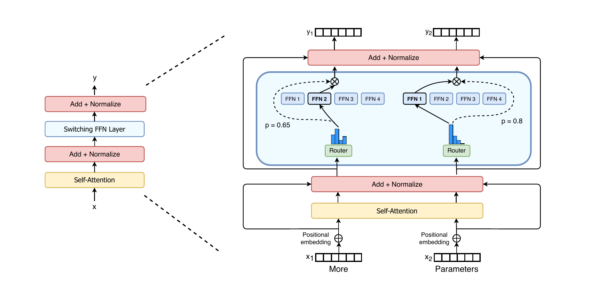

# 最小 Mixture-of-Experts（MoE）学习模块

> 用一个可直接运行、方便逐行阅读的 PyTorch 实现，理解稀疏 MoE 如何用多个专家替换 Transformer 的 FFN。

MoE 的核心不是让每个 token 经过所有专家，而是让 Router 为它挑选少量专家：参数量可以随专家数增长，而单个 token 的计算量近似不变。

## 文件结构

```
MOE/
├── moe.py            # Router、Expert、Top-k 路由、分发/聚合、均衡损失、Transformer Block
├── demo_train.py     # 不依赖数据集的分段函数训练示例
├── visualize_routing.py # 热力图与网页路由 JSON 导出
├── web/                 # 浏览器中的交互式 MoE Explainer 页面
├── assets/              # 架构图资源
├── requirements.txt     # PyTorch + matplotlib
└── README.md            # 本文档
```

## 快速开始

```bash
cd MOE
pip install -r requirements.txt

# 先看一次前向传播的形状和路由统计
python moe.py

# 在 toy task 上训练，约几十秒（视设备而定）
python demo_train.py

# 尝试每个 token 只选一个专家（Switch Transformer 风格）
python demo_train.py --top-k 1

# 可视化 3 层 MoE 中每个 token 被路由到哪个 Expert
python visualize_routing.py --layers 3 --tokens 12 --experts 4 --top-k 2
# 输出：output/routing.png

# 训练 3 层 toy MoE，并导出实际训练后学到的逐层路由
python demo_train.py --num-layers 3 --save-routing output/trained_routing.png
```

## 交互式 MoE Explainer（推荐）

`web/` 是一个不依赖前端框架的本地教学网页，目标是像交互式模型讲解站一样，逐步演示 MoE 内部数据如何流动，**不是一张静态图**。

页面包含两部分：

1. **左侧 Transformer Block 结构**：纵向展示 `Token states → Self-Attention → 残差 → MoE FFN → 残差`。其中高亮的 MoE FFN 是右侧路由图的放大对象；MoE 只替换传统 FFN，不替换 Attention。
2. **MoE FFN 四步讲解器**：选中一个 token 后，依次查看其隐藏表示 → Router 对所有 Expert 的 softmax 概率 → Top-k 截断与 gate 归一化 → 各 Expert 输出的加权合并。
3. **逐层路由图**：按层切换或自动播放，点击任一 token 查看它实际连接到哪些 Expert；还会显示完整概率分布、Expert 负载、容量和 overflow 数量。

页面顶部的 **Layers、Tokens、Experts、Top-k** 是可编辑参数。页面打开时，浏览器会随机生成 Router 概率、Top-k 选择、gate 权重和各层负载；修改任一参数并按 Enter，或点击“生成新的随机路由”，会重新生成一份模拟路由。`Top-k` 会自动限制为不大于 `Experts`。

### 直接打开并生成随机模拟

不需要训练模型或导入 JSON，页面打开时就会生成一份随机路由数据：

```bash
cd /home/lry/src/lry/EmbodiedZero/MOE/web
python -m http.server 8000
```

浏览器访问 [http://localhost:8000](http://localhost:8000)。你可以直接在页面顶部修改 Layers、Tokens、Experts、Top-k，然后按 Enter 或点击“生成新的随机路由”。

### 可选：导入真实模型路由

如果想让页面展示训练模型真实产生的数据，再额外导出并通过右上角“**导入真实路由 JSON**”选择文件：

```bash
cd /home/lry/src/lry/EmbodiedZero/MOE
python demo_train.py --num-layers 3 \
  --save-routing-json output/trained_routing.json
```

`trained_routing.json` 是数据文件，不能直接双击打开；需要在已打开的网页中选择它：

```text
/home/lry/src/lry/EmbodiedZero/MOE/output/trained_routing.json
```

导出的 JSON 由 `save_routing_trace` 创建，其中包含每层的完整 Router softmax 概率、Top-k Expert、gate 权重、expert load、capacity 和 dropped assignments。它只保存路由轨迹，不保存模型权重或梯度。

## 一张流程图



这里采用了现代稀疏 MoE 最具代表性的原始讲解图：**Switch Transformer, Figure 2**。它直观展示了 Transformer 中普通 FFN 被 Switch FFN 替换后，两个 token 如何由 Router 独立地选择不同 Expert，再乘以 gate 值合并输出。原图由 Fedus、Zoph、Shazeer 发布于 [*Switch Transformers: Scaling to Trillion Parameter Models with Simple and Efficient Sparsity*（JMLR, 2022）](https://jmlr.org/papers/v23/21-0998.html)，以 [CC BY 4.0](https://creativecommons.org/licenses/by/4.0/) 授权；本仓库保留该 PNG 并在此署名引用。

## 对应数学

设输入 token 为 $x_t$，共有 $E$ 个专家。Router 的概率为：

$$p_t = \operatorname{softmax}(W_r x_t) \in \mathbb{R}^{E}$$

令 $\mathcal{T}_t$ 为概率最高的 $k$ 个 expert，重新归一化权重 $g_{t,i}$ 后，MoE 输出为：

$$y_t = \sum_{i \in \mathcal{T}_t} g_{t,i}\,\operatorname{Expert}_i(x_t)$$

这里每个 `Expert` 都是普通两层 GELU FFN。区别只在于：普通 Transformer 的每个 token 通过**同一**个 FFN；MoE 则只调用它被分配到的少数专家。

## 组件与代码的对应关系

| 概念 | `moe.py` 中的位置 | 作用 |
|---|---|---|
| Expert | `Expert` | 一个独立的两层 FFN |
| Router / Gate | `Router` | 给 token 打分并 softmax 成概率 |
| Sparse Top-k | `torch.topk` | 只保留最相关的 $k$ 个专家 |
| Dispatch | `for expert_id, expert ...` | 按专家收集对应 token |
| Combine | `output.index_add_` | 按 gate 权重把 expert 输出合并回去 |
| 容量限制 | `_capacity` | 避免某专家接收过多 token |
| 负载均衡 | `aux_loss` | 防止 Router 长期只选择少数专家 |
| Transformer 集成 | `MoETransformerBlock` | 把标准 FFN 换成 `SparseMoE` |

## 为什么需要负载均衡？

如果所有 token 都路由到同一个 expert，其余专家得不到梯度，MoE 会退化成一个普通且拥堵的 FFN。实现采用 Switch Transformer 风格的辅助项：

$$\mathcal{L}_{\text{balance}} = E \sum_{i=1}^{E} f_i\,p_i$$

- $f_i$：实际 Top-k 路由到 expert $i$ 的频率；
- $p_i$：Router 给 expert $i$ 的平均软概率；
- 均匀路由时该值接近 1，越偏向少数 expert 越大。

训练总目标为：

$$\mathcal{L} = \mathcal{L}_{\text{task}} + \lambda\mathcal{L}_{\text{balance}}$$

在 `demo_train.py` 中，$\lambda$ 就是 `model.aux_loss_weight`，默认 `0.01`。若长期极不均匀，可提高辅助损失系数或检查 Router 学习率。

## 容量限制与丢 token

当 `capacity_factor=1.25` 时，每个 expert 最多处理：

$$C=\left\lceil1.25\times\frac{N\times k}{E}\right\rceil$$

其中 $N$ 是 token 数，$k$ 是 `top_k`，$E$ 是 expert 数。超出 $C$ 的 assignment 会在这个教学实现中被跳过，日志中的 `dropped` 会显示数量。这样能让实际计算量有上界；代价是被丢掉的那部分权重不会产生 expert 输出。

为了专注概念，示例用 Python 循环逐专家处理 token。真实训练通常会使用 grouped GEMM，并在多 GPU 间用 all-to-all 通信分发 token；算法结构仍然相同。

## 放进 Transformer

`MoETransformerBlock` 展示了最常见的替换点：保留 Attention，而将 FFN 换为 MoE。

```python
from moe import MoETransformerBlock

block = MoETransformerBlock(d_model=256, num_heads=8, num_experts=8, top_k=2)
x = torch.randn(2, 128, 256)
y, aux_loss, routing_info = block(x)

# 把 aux_loss 加到语言/视觉等任务的主损失中
loss = task_loss + 0.01 * aux_loss
```

注意：`aux_loss` 是一个额外返回值，不会自动进入优化目标；训练代码必须显式相加。

## 观察每一层的 Token 路由

`visualize_routing.py` 会为每个 MoE 层生成一个 `token × expert` 热力图。每一行是一个 token，每一列是一个 expert；有颜色且显示数值的格子就是该 token 实际走到的 expert，数字为归一化 gate 权重。于是：

- Top-1：每一行只有一个非零格；
- Top-2：每一行通常有两个非零格，且两者之和为 1；
- 同一 token 在不同层换列，说明它在不同层被分给了不同专家；
- 某一列长期接近空白，说明该 expert 可能塌缩；`load` 和 `dropped` 会显示在每层标题中。

要在自己的多层模型中记录路由，只需在前向时打开 `return_routing=True`：

```python
from moe import MoETransformerStack
from visualize_routing import plot_routing

model = MoETransformerStack(num_layers=3, d_model=256, num_heads=8, num_experts=8, top_k=2)
x = torch.randn(1, 16, 256)
output, aux_loss, routing_infos = model(x, return_routing=True)
plot_routing(routing_infos, num_experts=8, output_path="output/routing.png")
```

默认示例使用随机初始化权重，图只能说明路由机制如何工作。训练完成后再对固定输入调用同样的接口，才可以用它分析专家是否形成了有意义的分工。

如果只想生成可离线查看的热力图，最方便的训练后观察方式是：

```bash
python demo_train.py --num-layers 3 --save-routing output/trained_routing.png
```

它会训练 3 个残差 MoE 层，并将同一批测试 token 的逐层路由写入图片。每层的标题还会给出实际 `load` 和 `dropped` 数量。

## 建议的阅读顺序

1. 运行 `python moe.py`，确认输入输出形状和专家负载。
2. 阅读 `Router.forward` 与 `torch.topk`，理解“选择谁”。
3. 阅读 `SparseMoE.forward` 的 expert 循环，理解 Dispatch 和 Combine。
4. 运行 `demo_train.py --top-k 1`、再运行默认的 `--top-k 2`，观察负载与损失。
5. 最后看 `MoETransformerBlock`，把 MoE 与已学过的 Transformer FFN 对应起来。
